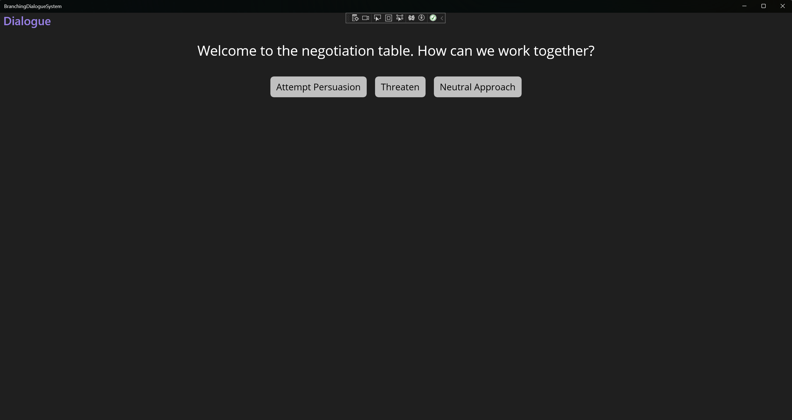
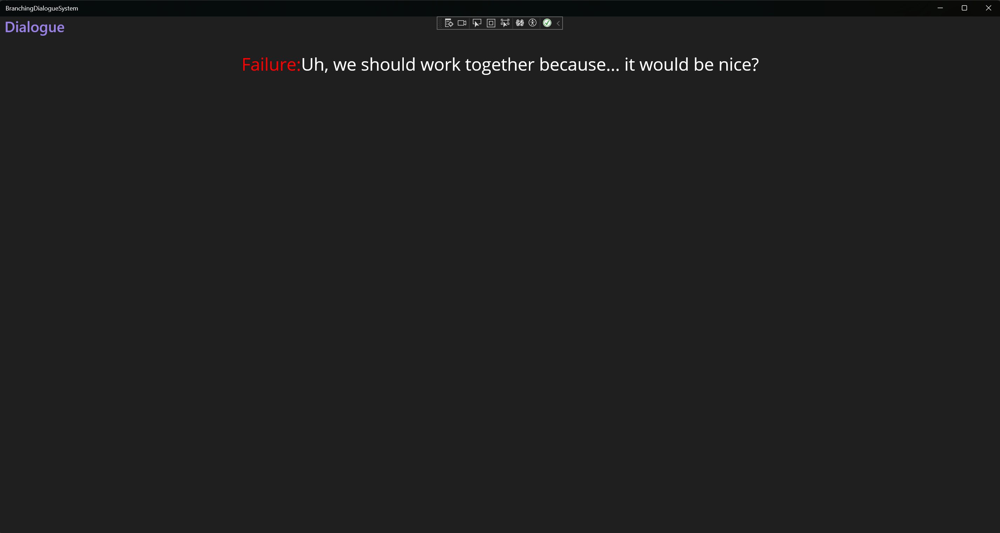

# Branching Dialogue System

**Advanced Programming**

**Dmitrii Kolchin**  
**2220982**

## Initial Research

For this project, I needed to use C# rather than C++, which meant that I couldn’t rely on Unreal Engine 5, my usual tool. However, I wanted to go beyond simple console output and create a more interactive user experience. Given C#’s versatility within the .NET ecosystem, I chose to implement this as a .NET MAUI (Multi-platform App UI) application. This choice allows the project to achieve more interactivity by integrating a user interface (UI) that supports:

- Parsing a JSON file to structure a dialogue tree.
- Dynamically generating buttons for each dialogue choice.
- Displaying the outcome to the player if the selected dialogue node is a leaf node in the dialogue tree.

Before diving into the implementation, I needed to familiarise myself with the basics of MAUI. For this, I completed two tutorials:
- **Build Your First App** [(davidbritch, 2024)](https://learn.microsoft.com/en-us/dotnet/maui/get-started/first-app?view=net-maui-8.0)
- **Create a .NET MAUI App** [(adegeo, s.d.)](https://learn.microsoft.com/en-us/dotnet/maui/tutorials/notes-app/?view=net-maui-8.0)

These resources on Microsoft’s .NET MAUI site provided a solid foundation for the core functionality required for this project.

## Implementation

### Model

The initial step in building the project was creating a foundational class for dialogue nodes:

```cs
internal class DialogueNode
{
    public string DialogueText { get; set; } = string.Empty;
    public DialogueNodeStatus Status { get; set; } = DialogueNodeStatus.Default;
    public ObservableCollection<string> DialogueChoiceTexts { get; set; } = new();
    public ObservableCollection<DialogueNode> DialogueChoiceNodes { get; set; } = new();
}
```

*Figure 1. DialogueNode class code snippet*

Each property in this `DialogueNode` class plays a specific role:
- **DialogueText** contains the dialogue’s displayed text.
- **DialogueChoiceTexts** holds an observable collection of strings representing the possible dialogue options that the player can choose from.
- **DialogueChoiceNodes** stores corresponding `DialogueNode` objects, representing the subsequent nodes if a particular choice is selected.
- **DialogueNodeStatus** is an enumerated type [(BillWagner, 2023)](https://learn.microsoft.com/en-us/dotnet/csharp/language-reference/builtin-types/enum) used to identify the node’s status: Success, Failure, Neutral, or Default. In this implementation, only leaf nodes (nodes with no further choices) should have a status other than `Default`.

To support JSON deserialization with readable strings, I added a `[JsonConverter]` attribute to the `DialogueNodeStatus` enum:

```cs
[JsonConverter(typeof(JsonStringEnumConverter))]
internal enum DialogueNodeStatus
{
    Success,
    Failure,
    Neutral,
    Default
}
```

*Figure 2. DialogueNodeStatus enum code snippet*

This attribute enables seamless conversion between JSON strings and enum values during serialization and deserialization, enhancing usability for input files.

### View

To display the dialogue system, I created a MAUI window in **DialoguePage.xaml**, which consists of two main sections: a horizontal layout for the dialogue text and a dynamic collection of buttons for the dialogue choices.

#### .xaml Layout

The `DialoguePage.xaml` layout design includes a vertically stacked arrangement of two main components:
- A horizontal stack containing the dialogue text and its status indicator.
- A `CollectionView` to display buttons for each choice in the dialogue.

##### Dialogue Text and Status

The upper layout displays the dialogue’s status and text in a `HorizontalStackLayout`:

```xaml
<HorizontalStackLayout Margin="20" HorizontalOptions="Center">
    <Label Text="Status: " FontSize="33" HorizontalOptions="Fill">
        <Label.Behaviors>
            <models:StatusTextBehavior/>
        </Label.Behaviors>
    </Label>
    <Label Text="{Binding DialogueText}" FontSize="33" HorizontalOptions="Fill"/>
</HorizontalStackLayout>
```

*Figure 3. Upper horizontal layout*

A custom `StatusTextBehavior` class is used to conditionally update the status label’s visibility and colour based on the dialogue context. The behaviour’s design allows it to dynamically react to changes in the dialogue node’s status.

##### StatusTextBehavior Class

The `StatusTextBehavior` class is responsible for modifying the label’s appearance based on the status of the current dialogue node:

```cs
internal class StatusTextBehavior : Behavior<Label>
{
    protected override void OnAttachedTo(Label bindable)
    {
        base.OnAttachedTo(bindable);
        bindable.BindingContextChanged += OnBindingContextChanged;
    }

    protected override void OnDetachingFrom(Label bindable)
    {
        base.OnDetachingFrom(bindable);
        bindable.BindingContextChanged -= OnBindingContextChanged;
    }

    private void OnBindingContextChanged(object sender, EventArgs e)
    {
        var label = (Label)sender;
        if (label.BindingContext is DialogueNode dialogue)
        {
            label.IsVisible = dialogue.Status != DialogueNodeStatus.Default;
            label.TextColor = dialogue.Status switch
            {
                DialogueNodeStatus.Success => Colors.Green,
                DialogueNodeStatus.Neutral => Colors.Yellow,
                DialogueNodeStatus.Failure => Colors.Red,
                _ => Colors.Black
            };
            label.Text = dialogue.Status != DialogueNodeStatus.Default ? $"{dialogue.Status}: " : "";
        }
    }
}
```

*Figure 4. StatusTextBehavior class*

This class binds to the `BindingContextChanged` event, adjusting the label's properties based on the dialogue node’s status. The `switch` statement assigns a different colour for each status, enhancing the visual feedback provided to the player.

##### Dialogue Choice Buttons

The collection of choice buttons is implemented using a `CollectionView` that dynamically generates buttons based on the `DialogueChoiceTexts` collection.

```xaml
<CollectionView x:Name="DialogueChoices" HorizontalOptions="Center" ItemsSource="{Binding DialogueChoiceTexts}" Margin="20" SelectionMode="None">
    <CollectionView.ItemsLayout>
        <LinearItemsLayout Orientation="Horizontal" ItemSpacing="10"/>
    </CollectionView.ItemsLayout>
    <CollectionView.ItemTemplate>
        <DataTemplate>
            <StackLayout>
                <Button Text="{Binding }" FontSize="22" BackgroundColor="Silver" TextColor="Black" Clicked="OnDialogueOptionChosen"/>
            </StackLayout>
        </DataTemplate>
    </CollectionView.ItemTemplate>
</CollectionView>
```

*Figure 5. Dialogue Choice buttons*

This `CollectionView` generates buttons for each dialogue choice. Each button’s text displays the option’s content, and the `Clicked` event triggers `OnDialogueOptionChosen`, which navigates to the next dialogue node.

#### .cs File

The **DialoguePage.xaml.cs** file contains the logic needed to initialize and interact with the dialogue tree.

```cs
public DialoguePage()
{
    InitializeComponent();

    string Filename = "D:\\UCA\\AdvancedProgramming2024\\BranchingDialogueSystem\\BranchingDialogueSystem\\Resources\\Dialogues\\DialogueJSON.txt";
    if (File.Exists(Filename))
    {
        string DialogueJson = File.ReadAllText(Filename);

        if (DialogueJson == null) return;

        DialogueNode Root = JsonSerializer.Deserialize<DialogueNode>(DialogueJson);

        if (Root == null) return;

        DisplayDialogue(Root);
    }
}
```

*Figure 6. DialoguePage class*

This constructor:
1. Initializes the UI components.
2. Reads the JSON file containing the dialogue data.
3. Deserializes the JSON into a `DialogueNode` object.
4. Calls `DisplayDialogue` to set the UI context to the root node of the dialogue tree.

##### Button Click Event

The button click event, `OnDialogueOptionChosen`, advances the dialogue based on the selected choice:

```cs
private async void OnDialogueOptionChosen(object sender, EventArgs e)
{
    await ((Button)sender).ScaleTo(0.9, 150);
    await ((Button)sender).ScaleTo(1, 150);

    string ButtonText = ((Button)sender).Text;
    var currentNode = (DialogueNode)BindingContext;

    for (int i = 0; i < currentNode.DialogueChoiceTexts.Count; i++)
    {
        if (currentNode.DialogueChoiceTexts[i] == ButtonText && i < currentNode.DialogueChoiceNodes.Count)
        {
            DisplayDialogue(currentNode.DialogueChoiceNodes[i]);
            break;
        }
    }
}
```

*Figure 7. OnDialogueOptionChosen() function implementation*

This method animates the button when clicked, fetches the text of the selected option, and updates the dialogue display to the next node in `DialogueChoiceNodes` based on the choice index.

The overall result looks like this:

*Figure 8. Dialogue options in the windows application*


*Figure 9. Dialogue options in the windows application*


For the full project, including code files and JSON examples, visit the repository [here](https://github.com/DmitryKolchin/AdvancedProgramming2024/tree/main/BranchingDialogueSystem).


## Critical Reflection
### What went well

- **Exploring C# and .NET**: This project provided a great introduction to working with C# and the .NET ecosystem, offering insights into different design patterns and UI features.
- **Task Completion**: The project met all functional requirements, successfully implementing a dynamic dialogue tree that interprets choices from a JSON file.
- **Flexible JSON-Based Dialogue**: The dialogue system’s reliance on a JSON file allows easy modifications or replacements of dialogue content, making it adaptable and extendable for future scenarios.

### Areas for Improvement

- **Error Handling**: The project’s error protection could be enhanced. In comparison to my C++ projects, the current error-handling strategies are basic. Strengthening exception handling, especially around file loading and data parsing, would improve stability and reliability.
- **Expanding Practical Utility**: While the current implementation meets the project goals, its standalone usability is limited. Transforming it into a more versatile dialogue editor could increase its practical value, allowing users to create, edit, and preview dialogues directly within the app.


## Bibliography
- adegeo (s.d.) Tutorial: Create a .NET MAUI app - .NET MAUI. At: https://learn.microsoft.com/en-us/dotnet/maui/tutorials/notes-app/?view=net-maui-8.0 (Accessed  25/10/2024).
- BillWagner (2023) Enumeration types - C# reference. At: https://learn.microsoft.com/en-us/dotnet/csharp/language-reference/builtin-types/enum (Accessed  30/10/2024).
- davidbritch (2023) Behaviors - .NET MAUI. At: https://learn.microsoft.com/en-us/dotnet/maui/fundamentals/behaviors?view=net-maui-8.0 (Accessed  30/10/2024).
- davidbritch (2024a) Build your first .NET MAUI app - .NET MAUI. At: https://learn.microsoft.com/en-us/dotnet/maui/get-started/first-app?view=net-maui-8.0 (Accessed  25/10/2024).
- davidbritch (2024b) Configure CollectionView item selection - .NET MAUI. At: https://learn.microsoft.com/en-us/dotnet/maui/user-interface/controls/collectionview/selection?view=net-maui-8.0 (Accessed  30/10/2024).
- davidbritch (2024c) Populate a CollectionView with Data - .NET MAUI. At: https://learn.microsoft.com/en-us/dotnet/maui/user-interface/controls/collectionview/populate-data?view=net-maui-8.0 (Accessed  30/10/2024).
- gewarren (2024) How to deserialize JSON in C# - .NET. At: https://learn.microsoft.com/en-us/dotnet/standard/serialization/system-text-json/deserialization (Accessed  30/10/2024).
- maddymontaquila (2024) Capture & edit desktop app UI with XAML Live Preview - Visual Studio (Windows). At: https://learn.microsoft.com/en-us/visualstudio/xaml-tools/xaml-live-preview?view=vs-2022 (Accessed  25/10/2024).


## Declared Assets

Assets made with AI:

- ```DevelopmentJournal.md```
- StatusTextBehavior.cs

