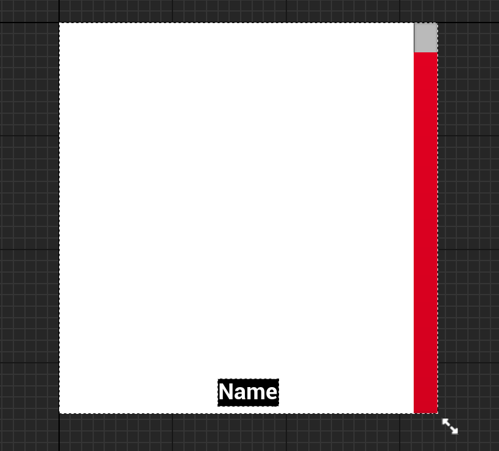
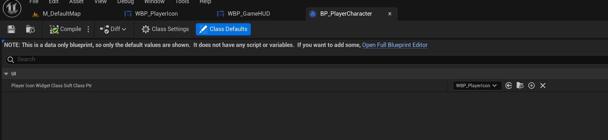

# Health Potion Optimisation

**Advanced Programming**

**Dmitrii Kolchin**  
**2220982**


## Initial Research

Initially, I wanted to separate this task into 2 different subtasks
- Implement the basic task with autohealing of all the characters with the provided potions instantly
- Implement healing with the following modifications:
	- Now each potion applies X points of health instantly and x% of maximum health in t seconds (diablo 4 reference)
- Applying new potion will stop previosuly used potion to add health

---

## Implementation

Initially, I created the ```Player Character``` class as a ```UObject``` instead of an ```AActor``` due to several reasons:
- I did not need any physical representation of the character in the scene, so inheriting from ```AActor``` wasn't necessary ([Actors in Unreal Engine | Unreal Engine 5.5 Documentation | Epic Developer Community, s.d.](https://dev.epicgames.com/documentation/en-us/unreal-engine/actors-in-unreal-engine)).
- I wanted to implement ```Blueprint Callable``` functions within the class. Since UStructs cannot provide the functionality of a ```UFunction```, it was more appropriate to use a ```UObject``` ([Structs in Unreal Engine | Unreal Engine 5.5 Documentation | Epic Developer Community, s.d.](https://dev.epicgames.com/documentation/en-us/unreal-engine/structs-in-unreal-engine)).

The class header looks like this:

```cpp
UCLASS( BlueprintType, Blueprintable )
class HPPOTIONOPTIMISATION_API UPlayerCharacter : public UObject
{
	GENERATED_BODY()

private:
	UPROPERTY()
	FText CharacterName;

	UPROPERTY()
	int32 CurrentHealth;

	UPROPERTY()
	int32 MaxHealth;

	UPROPERTY( EditDefaultsOnly, Category="UI" )
	TSoftClassPtr<UPlayerIconWidget> PlayerIconWidgetClassSoftClassPtr;

	UPROPERTY()
	UPlayerIconWidget* PlayerIconWidget;

public:
	/* Initialization from the provided Data Asset */
	UFUNCTION( BlueprintCallable )
	void Init(TSoftObjectPtr<UCharacterInfoDataAsset> CharacterInfoDataAssetSoftPtr);

	// GETTERS
	UFUNCTION( BlueprintPure )
	FText GetCharacterName() const;

	UFUNCTION( BlueprintPure )
	int32 GetCurrentHealth() const;

	UFUNCTION( BlueprintPure )
	int32 GetMaxHealth() const;

	UFUNCTION( BlueprintPure )
	UPlayerIconWidget* GetPlayerIconWidget() const;

	/* Function that adds health to the player, and clamps it according to the Max Health parameter value*/
	void AddHealth(int32 HealthToAdd);
};
```

*Figure 1. Player Character class.*

Each variable is clearly named to convey its function. The widget class is referenced through a soft class pointer, allowing it to be overridden in a Blueprint based on the ```UPlayerCharacter``` class. This soft reference ensures that I can later specify a Blueprint Widget Class for the player icon.

### Functions Breakdown

The ```Init()``` function accepts a Character Info Data Asset and uses it to initialize all stats, including the character name, max health, current health, and icon texture for the widget. Here's the logic in more detail:

```cpp
void UPlayerCharacter::Init(TSoftObjectPtr<UCharacterInfoDataAsset> CharacterInfoDataAssetSoftPtr)
{
	if (CharacterInfoDataAssetSoftPtr.IsNull())
	{
		ensureAlwaysMsgf( false, TEXT("CharacterInfoDataAssetSoftPtr is null") );
		return;
	}

	CharacterName = CharacterInfoDataAssetSoftPtr.LoadSynchronous()->CharacterName;
	CurrentHealth = CharacterInfoDataAssetSoftPtr.LoadSynchronous()->CurrentHealth;
	MaxHealth = CharacterInfoDataAssetSoftPtr.LoadSynchronous()->MaxHealth;

	if ( PlayerIconWidgetClassSoftClassPtr.IsNull() )
	{
		ensureAlwaysMsgf( false, TEXT("PlayerIconWidgetClassSoftClassPtr is null") );
		return;
	}

	PlayerIconWidget = Cast<UPlayerIconWidget>( CreateWidget( GetWorld(), PlayerIconWidgetClassSoftClassPtr.LoadSynchronous() ) );
	if ( !IsValid( PlayerIconWidget ) )
	{
		ensureAlwaysMsgf( false, TEXT("Unable to create player icon widget") );
		return;
	}

	PlayerIconWidget->SetCharacterName( CharacterName );
	PlayerIconWidget->SetCurrentHealthPercent( static_cast<float>( CurrentHealth ) / static_cast<float>( MaxHealth ) );
	PlayerIconWidget->SetPlayerIconTexture( CharacterInfoDataAssetSoftPtr.LoadSynchronous()->CharacterIcon );
}
```

*Figure 2. Init Function.*

This function ensures that all necessary attributes (name, health, icon) are initialized. It also validates the provided data asset and widget class pointers, guarding against potential null pointer issues during runtime.

The data asset class is structured as follows:

```cpp
UCLASS( BlueprintType )
class HPPOTIONOPTIMISATION_API UCharacterInfoDataAsset : public UDataAsset
{
	GENERATED_BODY()

public:
	UPROPERTY( EditDefaultsOnly, Category="Character Info" )
	FText CharacterName;

	UPROPERTY( EditDefaultsOnly, Category="Character Info" )
	UTexture2D* CharacterIcon;

	UPROPERTY( EditDefaultsOnly, Category="Character Info|Health" )
	int32 MaxHealth = 100.f;

	UPROPERTY( EditDefaultsOnly, Category="Character Info|Health" )
	int32 CurrentHealth = 100.f;
};
```

*Figure 3. Character Info Data Asset.*

Storing these values in a data asset centralizes character definitions, making it easier to manage and update character information. This design pattern allows seamless integration with future characters or additional data.

In the ```PlayerCharacter``` class, I also added these getter functions to access private member variables:

```cpp
FText UPlayerCharacter::GetCharacterName() const
{
	return CharacterName;
}

int32 UPlayerCharacter::GetCurrentHealth() const
{
	return CurrentHealth;
}

int32 UPlayerCharacter::GetMaxHealth() const
{
	return MaxHealth;
}

UPlayerIconWidget* UPlayerCharacter::GetPlayerIconWidget() const
{
	return PlayerIconWidget;
}
```

*Figure 4. Player Character getters.*

Encapsulation is preserved by keeping variables private and exposing data through these getter methods, ensuring controlled access to important character attributes.

The ```AddHealth()``` function is designed to add health while ensuring the value doesn't exceed the maximum health of the player. Here's the breakdown:

```cpp
void UPlayerCharacter::AddHealth(int32 HealthToAdd)
{
	UE_LOG(LogTemp, Warning, TEXT("Adding %d health to %s"), HealthToAdd, *CharacterName.ToString());
	CurrentHealth = FMath::Min( MaxHealth, CurrentHealth + HealthToAdd );
	if ( PlayerIconWidget )
	{
		PlayerIconWidget->SetCurrentHealthPercent( static_cast<float>( CurrentHealth ) / static_cast<float>( MaxHealth ) );
	}
}
```

*Figure 5. Add Health function.*

This function logs the health increase, calculates the new health, and clamps it using ```FMath::Min```, preventing the health from exceeding its defined maximum.

### PlayerIconWidget Class

The ```PlayerIconWidget``` class is declared in C++ as an abstract class to provide an interface for C++ classes. Its actual implementation is handled in Blueprints, leveraging Unreal's user-friendly UI system.

```cpp
class HPPOTIONOPTIMISATION_API UPlayerIconWidget : public UUserWidget
{
	GENERATED_BODY()

public:
	UFUNCTION(BlueprintImplementableEvent)
	void SetCharacterName(const FText& NewCharacterName);

	UFUNCTION(BlueprintImplementableEvent)
	void SetCurrentHealthPercent(float NewCurrentHealthPercent);

	UFUNCTION(BlueprintImplementableEvent)
	void SetPlayerIconTexture(UTexture2D* NewPlayerIconTexture);
};
```

*Figure 6. Player Icon Widget class public interface.*

This interface allows the setting of player-specific data (e.g., name, health, and icon) while the actual behavior is implemented in Blueprints.

At this point, I encountered a compilation error. After troubleshooting for about 30 minutes, with the help of ChatGPT, I found that I had forgotten to include the UMG module in the ```Build.cs``` file:

```cpp
PublicDependencyModuleNames.AddRange(new string[] { "Core", "CoreUObject", "Engine", "InputCore", "EnhancedInput" });
```

*Figure 7. My Build.cs.*

The correct version should be:

```cpp
PublicDependencyModuleNames.AddRange(new string[] { "Core", "CoreUObject", "Engine", "InputCore", "EnhancedInput", "UMG" });
```

*Figure 8. Correct Build.cs.*

For the health potion system, I opted to use a struct for the initial implementation:

```cpp
USTRUCT( BlueprintType )
struct FPotion
{
	GENERATED_BODY()

	UPROPERTY(EditDefaultsOnly, BlueprintReadWrite)
	FString PotionName;

	UPROPERTY(EditDefaultsOnly, BlueprintReadWrite)
	int32 HealingValue;
};
```

*Figure 9. FPotion Struct.*


### HealPlayers Function

The ```HealPlayers``` function is responsible for healing multiple players using available potions. The core of the function involves sorting potions, iterating through players, and applying the appropriate healing values from the potions. The logic ensures that no potion is wasted on a player who is already at full health and optimizes the usage of available potions by healing players as much as possible without exceeding their maximum health.

```cpp
void UHealthPotionSystem::HealPlayers(TArray<UPlayerCharacter*> Players)
{
	// Let's sort all the available potions in descending order of healing value
	Potions.Sort( [](const FPotion& A, const FPotion& B)
	{
		return A.HealingValue > B.HealingValue;
	} );

	// Outer loop to iterate over all players
	for ( auto Player : Players )
	{
		UE_LOG( LogTemp, Warning, TEXT("%s currently has %d/%d health"), *Player->GetCharacterName().ToString(), Player->GetCurrentHealth(), Player->GetMaxHealth() );
		// Initial check to see if the player is already at full health
		if (Player->GetMaxHealth() == Player->GetCurrentHealth())
		{
			continue;
		}

		// Inner loop to iterate over all potions
		for ( int32 PotionIndex = 0; PotionIndex < Potions.Num(); ++PotionIndex )
		{
			// If we can heal this player without exceeding the max health, we can use this potion
			float MissingHealth = Player->GetMaxHealth() - Player->GetCurrentHealth();
			if ( Potions[ PotionIndex ].HealingValue <= MissingHealth )
			{
				// Applying the healing value of the potion to the player, and removing the potion
				Player->AddHealth( Potions[ PotionIndex ].HealingValue );
				Potions.RemoveAt( PotionIndex );
			}
		}

		// If the player is not at full health, and we still have potions left, we can use the last potion
		// We will waste the potion, but the player will be fully healed
		if ( Player->GetCurrentHealth() < Player->GetMaxHealth() && Potions.Num() > 0 )
		{
			Player->AddHealth( Potions.Last().HealingValue );
			Potions.RemoveAt( Potions.Num() - 1 );
		}
	}
}

```

*Figure 10. HealPlayers function.*

This function first sorts all available potions in descending order by their ```HealingValue``` to prioritize the most effective potion. After sorting, it iterates over each player, checking if they are missing any health. If a player is not at full health, the function looks for a suitable potion whose healing value can restore the player's health without exceeding their maximum health.

If such a potion is found, the player's health is increased by the potion’s value, and the potion is removed from the inventory. If a player is still missing health after using available potions and there are still potions left, the last potion is used, even if it means some of the potion's healing power is wasted.

---

### Blueprint Setup

After completing the C++ implementation, the focus shifts to creating a blueprint for the ```PlayerIconWidget``` class, which serves as the UI element for each player. The widget will display the player’s health and other relevant information. All the functionality declared in the C++ class is implemented in the blueprint, making it easier to work with the widget elements in Unreal's Blueprint Widget Editor.



*Figure 11. Player Icon Widget layout.*

The visuals of the widget are arranged as shown in *Figure 11*, including text elements for the player's name and health, as well as a health bar. Each widget is tied to a ```PlayerCharacter```, and the blueprint handles setting the player's name, current health, and icon texture.

#### Set Character Name Blueprint Implementation

The ```SetCharacterName``` function updates the player's name in the widget. This is done via a blueprint event that is triggered whenever the player's name changes.

<iframe src="https://blueprintue.com/render/kt23yfza/" scrolling="no" allowfullscreen width="100%" height="500"></iframe>

*Figure 12. Set Character Name Blueprint implementation.*

#### Set Current Health Percent Blueprint Implementation

The ```SetCurrentHealthPercent``` function calculates and updates the health bar based on the player's current health relative to their maximum health.

<iframe src="https://blueprintue.com/render/ub9-nntk/" scrolling="no" allowfullscreen width="100%" height="500"></iframe>

*Figure 13. Set Current Health Percent Blueprint Implementation.*

#### Set Player Icon Texture Blueprint Implementation

The ```SetPlayerIconTexture``` function updates the player's icon in the widget, typically displaying a character portrait or other identifying image.

<iframe src="https://blueprintue.com/render/q5sii6c9/" scrolling="no" allowfullscreen width="100%" height="500"></iframe>

*Figure 14. Set Player Icon Texture Blueprint Implementation.*

---

### Assigning the Player Icon Widget

To tie everything together, the blueprint child of the ```PlayerCharacter``` class needs to be configured to use the custom ```PlayerIconWidget``` we created. This is done by setting the ```PlayerIconWidgetClass``` in the blueprint to point to the appropriate widget blueprint.



*Figure 15. Player Character Blueprint child with assigned widget class.*

---

### Testing the Health Potion System

To verify that the system works as expected, a simple setup is created in the level blueprint. This setup spawns players, adds potions to the system, and triggers the healing process after a short delay.

<iframe src="https://blueprintue.com/render/f7nu6z4x/" scrolling="no" allowfullscreen width="100%" height="500"></iframe>

*Figure 16. Logic for initialising players, adding potions, and healing them after a delay.*

This test setup demonstrates how characters can be initialised with health values and how the potion system heals them accordingly. The test results can be observed both in the UI (where the widgets reflect the health changes) and in the output logs, which show the healing process step by step.

---

### Result of the Health Potion System

The final system reflects health changes accurately in the UI, as shown in the following GIF:


*Figure 17. Widgets reflecting the health changes. The character images were taken Baldur's Gate III (Baldur’s Gate III, 2023)*

The logs further confirm that the potion system works as intended, with characters being healed based on their missing health and the availability of potions:

```
LogTemp: Warning: Astarion currently has 50/100 health
LogTemp: Warning: Adding 50 health to Astarion
LogTemp: Warning: Karlach currently has 70/100 health
LogTemp: Warning: Adding 20 health to Karlach
LogTemp: Warning: Adding 10 health to Karlach
LogTemp: Warning: Laezel currently has 65/100 health
LogTemp: Warning: Adding 20 health to Laezel
LogTemp: Warning: Adding 10 health to Laezel
LogTemp: Warning: Adding 10 health to Laezel
LogTemp: Warning: Shadowheart currently has 85/100 health
LogTemp: Warning: Adding 10 health to Shadowheart
LogTemp: Warning: Adding 10 health to Shadowheart
```

*Figure 18. Logs of the healing process.*

### Reimagining the healing system
Int32 -> float
First of all, I changed all the int32 types to float in health calculations. Sicne now we are talking about the percents, the added values are not gonna be integer, and keeping 
health as an integer value will make it complicated

Secondly, I created a new potion struct:
```cpp
USTRUCT( BlueprintType )
struct FOverTimeHealingPotion
{
	GENERATED_BODY()

	UPROPERTY( EditDefaultsOnly, BlueprintReadWrite )
	FString PotionName;

	/** How many health points is restored instantly */
	UPROPERTY( EditDefaultsOnly, BlueprintReadWrite )
	float InstantHealingValue;

	/** Which percent of max health is restored over time */
	UPROPERTY( EditDefaultsOnly, BlueprintReadWrite )
	float MaxHealthPercentageToHealOverTime;

	/** How long the healing effect lasts in total*/
	UPROPERTY( EditDefaultsOnly, BlueprintReadWrite )
	float TotalHealingDuration;

	/** How long the healing effect has been active */
	UPROPERTY( )
	float ElapsedHealingDuration;

	float GetTotalHealingValue(const float MaxHealth) const
	{
		return InstantHealingValue + MaxHealth * MaxHealthPercentageToHealOverTime;
	}

	float GetHealingValuePerTick(const float MaxHealth, const float DeltaTime)
	{
		return (MaxHealth * MaxHealthPercentageToHealOverTime / TotalHealingDuration) * DeltaTime;
	}
};
```

It has the name as the old potion. It has Instant Healing Value, MaxHealthPercentageToHealOverTime and Total Healing Duration settable variables, which define how many healthpoints
will the player get and how long it will take it
It also has ElapsedHealingDuration - service variable to track how long this exact instance has been applied

GetTotalHealingValue and GetHealingValuePerTick are also service functions that hide calculations behind themselves

Next - we need to add the trackable active potion to character.
Since it is important for me to track two different facts:
- Does the player have any active potion (to start the each tick timer if it has not )
- What is the active potion

The most dull approach would be to create a bool variable: set it when the active potion is initialized, and reset it when it expires
Unreal Engine laready has a prebuild solution called TOptional<> just for this case [(ui, 2020)](https://benui.ca/unreal/toptional/):
```cpp
UPROPERTY()
TOptional<FOverTimeHealingPotion> ActiveHealingPotion;
```
Alternative approach would be to isolate all the logic I will call every tick into the Tick() function,
but the UPlayerCharacter is a UObject, not an AActor, it does not have a Tick() function in it

Now, we need to add the opportunity to setup new healing potion:
```cpp
void UPlayerCharacter::SetNewOverTimeHealingPotion(const FOverTimeHealingPotion& NewOverTimeHealingPotion)
{
	if ( !IsValid( PlayerIconWidget ) )
	{
		ensureAlwaysMsgf( false, TEXT("PlayerIconWidget is not valid") );
		return;
	}

	// If we have no active healing potion, we start the healing effect
	if ( !ActiveHealingPotion.IsSet() )
	{
		GetWorld()->GetTimerManager().SetTimerForNextTick( this, &UPlayerCharacter::ApplyOverTimeHealingPotionPerTick );
	}

	// Setting the new active healing potion
	ActiveHealingPotion = NewOverTimeHealingPotion;

	// Calculating potential health to show it on the UI
	float PotentialHealth = FMath::Min( MaxHealth, CurrentHealth + ActiveHealingPotion.GetValue().GetTotalHealingValue( MaxHealth) );
	PlayerIconWidget->SetPotentialHealthPercent( PotentialHealth / MaxHealth );

	// Adding the instant healing value to the player
	AddHealth( ActiveHealingPotion.GetValue().InstantHealingValue );
}
```
This function accepts the new active healing potion. If there is already active healing potion, the health update function will be called next tick anyway, so we do not need to
add another call. Otherwise, I set a one tick timer 

It also calls a cosmetical SetPotentialHealthPercent on the PlayerIconWidget, to indicate how many health points will be restored over time

The ApplyOverTimeHealingValue function looks like this:

```cpp

void UPlayerCharacter::ApplyOverTimeHealingPotionPerTick()
{
	if ( !IsValid( GetWorld() ) )
	{
		ensureAlwaysMsgf( false, TEXT("World is not valid") );
		return;
	}

	// If we do not have any active healing potion, we stop the function
	if ( !ActiveHealingPotion.IsSet() )
	{
		return;
	}

	float DeltaSeconds = GetWorld()->GetDeltaSeconds();

	// Calculating the added health
	float HealingValuePerTick = ActiveHealingPotion.GetValue().GetHealingValuePerTick( MaxHealth, DeltaSeconds );

	// Adding the health to the player
	AddHealth( HealingValuePerTick );

	ActiveHealingPotion.GetValue().ElapsedHealingDuration += GetWorld()->GetDeltaSeconds();

	// If the healing effect has expired or the player is at full health, we stop the healing effect
	if ( ActiveHealingPotion.GetValue().ElapsedHealingDuration >= ActiveHealingPotion.GetValue().TotalHealingDuration || CurrentHealth == MaxHealth )
	{
		ActiveHealingPotion.Reset();
		return;
	}

	GetWorld()->GetTimerManager().SetTimerForNextTick( this, &UPlayerCharacter::ApplyOverTimeHealingPotionPerTick );
}

```

Nothing much. It checks whether the player has max health or the potion has expired, and sets a timer for next tick to call itself otherwise.
And, of coruse, heals player for the required amount of health points.


Additionally, I added a separate function inside the Health Potion System to use only onlu one over time potion per character per call instead of using all of the generic potions:
```cpp
void UHealthPotionSystem::HealPlayersWithOverTimePotions(TArray<UPlayerCharacter*> Players)
{
	// Let's sort all the available potions in descending order of healing value
	OverTimeHealingPotions.Sort( [](const FOverTimeHealingPotion& A, const FOverTimeHealingPotion& B)
	{
		return A.InstantHealingValue > B.InstantHealingValue;
	} );

	// Outer loop to iterate over all players
	for ( auto Player : Players )
	{
		UE_LOG( LogTemp, Warning, TEXT("%s currently has %f/%f health"), *Player->GetCharacterName().ToString(), Player->GetCurrentHealth(), Player->GetMaxHealth() );
		// Initial check to see if the player is already at full health
		if ( Player->GetMaxHealth() == Player->GetCurrentHealth() )
		{
			continue;
		}

		bool bPotionWasApplied = false;

		// Inner loop to iterate over all potions
		for ( int32 PotionIndex = 0; PotionIndex < OverTimeHealingPotions.Num(); ++PotionIndex )
		{
			// If we can heal this player without exceeding the max health, we can use this potion
			float MissingHealth = Player->GetMaxHealth() - Player->GetCurrentHealth();
			float RestoredHealth = OverTimeHealingPotions[ PotionIndex ].GetTotalHealingValue( Player->GetMaxHealth() );
			if ( RestoredHealth <= MissingHealth )
			{
				// Applying the healing value of the potion to the player, and removing the potion
				Player->SetNewOverTimeHealingPotion( OverTimeHealingPotions[ PotionIndex ] );
				OverTimeHealingPotions.RemoveAt( PotionIndex );
				bPotionWasApplied = true;
				break;
			}
		}

		if ( bPotionWasApplied )
		{
			continue;
		}

		// If the player is not at full health, and we still have potions left, we can use the last potion
		// We will waste the potion, but the player will be fully healed
		if ( Player->GetCurrentHealth() < Player->GetMaxHealth() && OverTimeHealingPotions.Num() > 0 )
		{
			Player->SetNewOverTimeHealingPotion( OverTimeHealingPotions.Last() );
			OverTimeHealingPotions.RemoveAt( OverTimeHealingPotions.Num() - 1 );
		}
	}
}
```

Now let's see the results.
I changed the intial Astarion's health to 10 so the example would be more visible.

As we can see, the health is restored bit by bit.


Another example - I called another potions apply in 1.5 secs after the first call, so that the new potion will be applied when the old one is not expired yet:


## Bibliography
Actors in Unreal Engine | Unreal Engine 5.5 Documentation | Epic Developer Community (s.d.) At: https://dev.epicgames.com/documentation/en-us/unreal-engine/actors-in-unreal-engine (Accessed  17/10/2024).

Baldur’s Gate III (2023) 

Structs in Unreal Engine | Unreal Engine 5.5 Documentation | Epic Developer Community (s.d.) At: https://dev.epicgames.com/documentation/en-us/unreal-engine/structs-in-unreal-engine (Accessed  17/10/2024).


## Declared Assets

[Baldur's Gate 3 Icons](https://www.tumblr.com/pierkyn/724308777705357312/baldurs-gate-3-companions-icons-the-gangs)

Assets made with AI:
DevelopmentJournal.md

