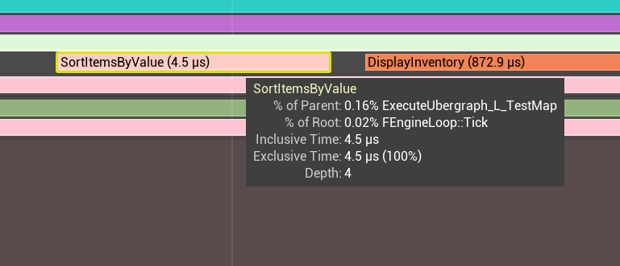
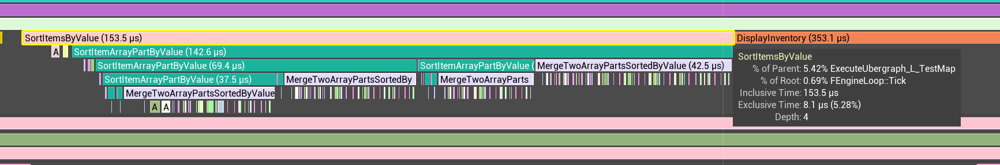

# Inventory Sorting

**Advanced Programming**

**Dmitrii Kolchin**  
**2220982**

---

## Research

For this task, I focused on two main areas of research: the **Merge Sort algorithm** and **Unreal Insights**, a profiling tool within Unreal Engine. The latter is critical for optimizing performance, particularly with the goal of maintaining a steady 60 FPS in Unreal Engine projects.

### Merge Sort Algorithm

Although I had prior experience with merge sort, I revisited the algorithm to ensure a robust and accurate implementation. To support this, I referred to the article on merge sort provided by GeeksforGeeks ([GeeksforGeeks, 2013](https://www.geeksforgeeks.org/merge-sort/)) for a detailed breakdown of the algorithm.

### Unreal Insights Profiler

In order to maintain performance standards, it is essential to utilize efficient profiling tools. For this project, I focused on refreshing my knowledge of **Unreal Insights**, Unreal Engine’s built-in profiler. To avoid community-driven guides or tutorials, I referred directly to official documentation and resources provided by **Epic Games**.

The first exposure I had to Unreal Insights was through **Ari Arnbjörnsson's presentation** at Unreal Fest 2022, which provided an in-depth look at the tool. You can view the presentation below:

<iframe width="560" height="315" src="https://www.youtube.com/embed/GuIav71867E?si=Mu1Hnq_-vtIEc6uh" title="YouTube video player" frameborder="0" allow="accelerometer; autoplay; clipboard-write; encrypted-media; gyroscope; picture-in-picture; web-share" referrerpolicy="strict-origin-when-cross-origin" allowfullscreen></iframe>

*Figure 1. Maximizing Your Game's Performance in Unreal Engine | Unreal Fest 2022*

After watching the presentation, I proceeded with additional research by studying the official documentation from Epic Games: [Trace Insights](https://dev.epicgames.com/documentation/en-us/unreal-engine/trace-in-unreal-engine-5).

---

## Implementation

To streamline the inventory system, I created a `UInventory` class, derived from `UObject`, which encapsulates all the functionality related to item management and sorting.

### Struct Design for Inventory Items

To optimize memory usage and improve performance, I refactored the provided `Item` class into a struct. As the item data does not require Blueprint Callable methods, nor does it need to be tracked by the Garbage Collector, a struct was the ideal choice. This also includes a `ToString()` method for easy display of item details and will be helpful in testing.

```cpp
USTRUCT(BlueprintType)
struct FInventoryItem
{
	GENERATED_BODY()

	UPROPERTY(EditDefaultsOnly, BlueprintReadWrite)
	FString Name;

	UPROPERTY(EditDefaultsOnly, BlueprintReadWrite)
	int32 Value;

	FString ToString() const
	{
		return Name + " " + FString::FromInt(Value);
	}
};
```
*Figure 2. Inventory item struct*

This struct enables the `UInventory` class to manage an array of `FInventoryItem` instances, with the array declared as protected to ensure encapsulation and allow access only within the Blueprint child class.

```cpp
protected:
	UPROPERTY(BlueprintReadWrite)
	TArray<FInventoryItem> Items;
```
*Figure 3. Items array*

### Inventory API Implementation

In order to be synced with the original task, I implemented methods to add items and display them. These functions are marked as **Blueprint Callable** to enable easy testing and integration through Blueprints.

```cpp
void UInventory::AddItem(const FInventoryItem& Item)
{
	Items.Add(Item);
}

void UInventory::DisplayInventory()
{
	FString SeparationLine{"----------------"};
	UE_LOG(LogTemp, Warning, TEXT("%s"), *SeparationLine);

	for (auto Item : Items)
	{
		UE_LOG(LogTemp, Warning, TEXT("%s"), *Item.ToString());
	}

	UE_LOG(LogTemp, Warning, TEXT("%s"), *SeparationLine);
}
```
*Figure 4. Inventory interface*

---

## Sorting Logic

### C++ Sorting Implementation

To avoid code-duplication, I implemented the sorting mechanism using a templated merge sort function, which accepts a comparator function. This approach allows for flexible sorting by different criteria, such as item name or item value, without rewriting the sorting algorithm itself.

#### Private Templated Merge Sort Function

```cpp
private:
	template <typename F>
	void SortItemsArrayPart(int32 LeftBorder, int32 RightBorder, F Comparator)
	{
		// If the left border is greater or equal to the right border, then the array can be considered already sorted
		if ( RightBorder <= LeftBorder )
		{
			return;
		}

		// Dividing the array into two parts and sorting them separately
		int32 MidBorder = LeftBorder + ( RightBorder - LeftBorder ) / 2;
		SortItemsArrayPart( LeftBorder, MidBorder, Comparator );
		SortItemsArrayPart( MidBorder + 1, RightBorder, Comparator );

		// Merging two sorted parts
		MergeTwoSortedItemArrayParts( LeftBorder, MidBorder, RightBorder, Comparator );
	};

	template <typename F>
	void MergeTwoSortedItemArrayParts(int32 LeftBorder, int32 MidBorder, int32 RightBorder, F Comparator)
	{
		// Copying the left and right parts to separate arrays
		TArray<FInventoryItem> LeftPart;
		TArray<FInventoryItem> RightPart;

		for ( int32 Index = LeftBorder; Index <= MidBorder; Index++ )
		{
			LeftPart.Add( Items[ Index ] );
		}

		for ( int32 Index = MidBorder + 1; Index <= RightBorder; Index++ )
		{
			RightPart.Add( Items[ Index ] );
		}

		// Merging the left and right parts using provided comparator

		int32 CurrentLeftItemIndex = 0;
		int32 CurrentRightItemIndex = 0;

		int32 CurrentMainItemIndex = LeftBorder;

		while ( CurrentLeftItemIndex < LeftPart.Num() && CurrentRightItemIndex < RightPart.Num() )
		{
			if ( Comparator( LeftPart[ CurrentLeftItemIndex ], RightPart[ CurrentRightItemIndex ] ) )
			{
				Items[ CurrentMainItemIndex++ ] = LeftPart[ CurrentLeftItemIndex++ ];
			}
			else
			{
				Items[ CurrentMainItemIndex++ ] = RightPart[ CurrentRightItemIndex++ ];
			}
		}

		// Copying the remaining items from the left and right parts

		while ( CurrentLeftItemIndex < LeftPart.Num() )
		{
			Items[ CurrentMainItemIndex++ ] = LeftPart[ CurrentLeftItemIndex++ ];
		}

		while ( CurrentRightItemIndex < RightPart.Num() )
		{
			Items[ CurrentMainItemIndex++ ] = RightPart[ CurrentRightItemIndex++ ];
		}
	};


```
*Figure 5. Merge sort under-the-hood implementation*

#### Public Sorting Methods

These functions serve as entry points for sorting by item name and item value, utilizing the templated merge sort function:

```cpp
void UInventory::SortItemsByName_Implementation()
{
	SortItemsArrayPart(0, Items.Num() - 1, [](const FInventoryItem& Left, const FInventoryItem& Right)
	{
		return Left.Name < Right.Name;
	});
}

void UInventory::SortItemsByValue_Implementation()
{
	SortItemsArrayPart(0, Items.Num() - 1, [](const FInventoryItem& Left, const FInventoryItem& Right)
	{
		return Left.Value < Right.Value;
	});
}
```
*Figure 6. Merge public interface*
#### Testing

In order to check that our sorting is working properly, I created a simple Blueprint script within the level blueprint which tests the sorts:

<iframe width="100%" height="500px" src="https://blueprintue.com/render/q1xj89de/" scrolling="no" allowfullscreen></iframe>

*Figure 7. Blueprint logic for testing sorts*

And it gives us the following results:
```md
LogTemp: Warning: ----------------
LogTemp: Warning: Sword 150
LogTemp: Warning: Potion 50
LogTemp: Warning: Shield 100
LogTemp: Warning: Bow 120
LogTemp: Warning: Helmet 80
LogTemp: Warning: ----------------
LogTemp: Warning: ----------------
LogTemp: Warning: Potion 50
LogTemp: Warning: Helmet 80
LogTemp: Warning: Shield 100
LogTemp: Warning: Bow 120
LogTemp: Warning: Sword 150
LogTemp: Warning: ----------------
LogTemp: Warning: ----------------
LogTemp: Warning: Bow 120
LogTemp: Warning: Helmet 80
LogTemp: Warning: Potion 50
LogTemp: Warning: Shield 100
LogTemp: Warning: Sword 150
LogTemp: Warning: ----------------
```
*Figure 8. Output log*
### Blueprint Sorting

Due to limitations in Unreal Engine’s Blueprint system, specifically its lack of built-in string comparison, I implemented sorting by value only in Blueprints. The algorithm for sorting by name would have all the same nodes except for comparison itself. A child class `BP_Inventory` was created, which overrides the C++ sorting methods and provides a Blueprint-based implementation.


<iframe width="100%" height="500px" src="https://blueprintue.com/render/pw3y6wl_/" scrolling="no" allowfullscreen></iframe>

*Figure 9. Sorting by value Blueprints implementation*
<iframe  width="100%" height="500px" src="https://blueprintue.com/render/t7-vzjuh/" scrolling="no" allowfullscreen></iframe>

*Figure 10. Sorting part of the array by value Blueprints implementation*
<iframe width="100%" height="500px" src="https://blueprintue.com/render/qjhqut7j/" scrolling="no" allowfullscreen></iframe>

*Figure 11. Merging two sorted array parts in Blueprints*

---

## Performance Comparison

To assess the performance of the C++ and Blueprint implementations, I conducted tests using **Unreal Insights**. To ensure accuracy, I added a delay node before sorting to isolate the initialization logic from the sorting operation. Print statements were also inserted to make the function calls easier to trace in the profiler. Here is the Blueprint Script I used for performance testing
<iframe width="100%" height="500px" src="https://blueprintue.com/render/lh47imgp/" scrolling="no" allowfullscreen></iframe>

*Figure 12. Testing logic in level blueprint*

### Outcome

**C++ Sorting Performance:**  
*4.5 microseconds*  



*Figure 13. Unreal Insights screenshot for C++ implementation*

**Blueprint Sorting Performance:**  
*153.5 microseconds*  


*Figure 14. Unreal Insights screenshot for Blueprint implementation*

As demonstrated by these results, the Blueprint version is approximately **34 times slower** than the C++ implementation. This highlights the significant performance overhead associated with Blueprint scripting for computationally intensive tasks such as sorting.

All the project files with the implementations and testing code could be found [here](https://github.com/DmitryKolchin/AdvancedProgramming2024/tree/main/InventorySorting)

---

## Critical Reflection

### What Went Well:
- Gained hands-on experience with **Unreal Insights**, providing valuable insights into performance optimization.
- Refreshed and successfully implemented the **Merge Sort algorithm**, ensuring optimal performance for the sorting operation.

### What Could Be Improved:
- Further optimization could be explored in the Blueprint implementation to reduce the significant overhead observed during testing.

---

## Bibliography

- Barry (2016) Answer to ‘How to pass a custom comparator to a custom function C++’. At: https://stackoverflow.com/a/35997364 (Accessed  28/09/2024).
- Maximizing Your Game’s Performance in Unreal Engine | Unreal Fest 2022 (2022) At: https://www.youtube.com/watch?v=GuIav71867E (Accessed  28/09/2024).
- Merge sort (2024) In: Wikipedia. At: https://en.wikipedia.org/w/index.php?title=Merge_sort&oldid=1243235598 (Accessed  28/09/2024).
- Merge Sort - Data Structure and Algorithms Tutorials (2013) At: https://www.geeksforgeeks.org/merge-sort/ (Accessed  28/09/2024).
- UFunctions in Unreal Engine | Unreal Engine 5.4 Documentation | Epic Developer Community (s.d.) At: https://dev.epicgames.com/documentation/en-us/unreal-engine/ufunctions-in-unreal-engine (Accessed  28/09/2024).
- Unreal Insights Reference in Unreal Engine 5 | Unreal Engine 5.4 Documentation | Epic Developer Community (s.d.) At: https://dev.epicgames.com/documentation/en-us/unreal-engine/unreal-insights-reference-in-unreal-engine-5 (Accessed  24/09/2024).
- Unreal Insights Session Browser for Unreal Engine | Unreal Engine 5.4 Documentation | Epic Developer Community (s.d.) At: https://dev.epicgames.com/documentation/en-us/unreal-engine/unreal-insights-session-browser-for-unreal-engine (Accessed  30/09/2024).


## Declared Assets

The following assets were created or modified with the use of GPT 4o:
- ```DevelopmentJournal.md```
